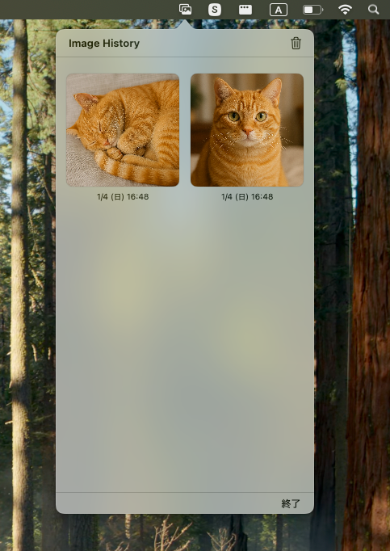

# ImageClipboardHistory

画像専用のクリップボード履歴管理ツール（macOS向けメニューバー常駐アプリ）です。

## 機能
- **画像専用履歴**: テキストは無視し、画像データのコピーのみを最大100件まで保存。
- **クイック再利用**: 履歴内の画像をクリック、または `Enter` キーで即座にクリップボードへ復元。
- **グローバルショートカット**: `Shift + Command + X` でいつでもどこでも履歴を呼び出し（アニメーションなしで瞬時に起動）。
- **モダンなUI**:
    - マウスホバーによる直感的な選択フィードバック。
    - ウィンドウ幅を活かした見やすいグリッド表示（日時・曜日付き）。
    - ヘッダーの「ImageClipboardHistory」とコンパクトなツールバー。
- **軽量動作**: Dockを汚さずメニューバーだけで常駐。

## 🖼️ スクリーンショット



## 動作環境
- macOS 13.0 以降

## インストール方法

### ダウンロード（推奨）
1. [Releases](https://github.com/abustoY/ImageClipboardHistory/releases) から最新の `.zip` ファイルをダウンロード
2. ZIPを解凍
3. `ImageClipboardHistory.app` を `/Applications` フォルダにドラッグ
4. アプリを起動

### ⚠️ 「マルウェアが含まれていないことを検証できません」と表示される場合

このアプリは Apple の公証を受けていないため、macOSのセキュリティ機能（Gatekeeper）により初回起動時にブロックされる場合があります。

#### 🔧 ターミナルで隔離属性を削除してください

```bash
xattr -d com.apple.quarantine /Applications/ImageClipboardHistory.app
```

### ログイン項目の設定（PC起動時に自動起動させたい場合）
1. システム設定 > 一般 > ログイン項目 を開く
2. 「ログイン時に開く」の `+` ボタンを押し、`ImageClipboardHistory.app` を追加

## 使い方
1. アプリを起動します（初回は許可を求められる場合があります）。
2. **操作方法**:
    - **Shift + Command + X**: どこからでも履歴ウィンドウを開く。
    - **Enter (Return)**: ウィンドウが開いている時に最新の画像をコピーして閉じる。
    - **クリック**: 履歴内の画像をクリックするとクリップボードにコピー。
3. メニューバーのアイコン、またはショートカットから履歴を確認できます。

## ライセンス
MIT License (または、お好きなライセンスをここに記載してください)

## 開発者を支援する (Support)
もしこのアプリを気に入っていただけたら、サポートしていただけると今後の開発の励みになります！

- [GitHub Sponsors](https://github.com/sponsors/abustoY)

## 開発者向け

### プロジェクト構造
- `ImageClipboardHistoryApp.swift`: アプリのメインエントリポイント
- `ContentView.swift`: サムネイル一覧を表示するUI部分
- `ClipboardImageHistory.swift`: クリップボード監視ロジック

### ソースからビルド
Xcode 14.0以上が必要です。

1. **プロジェクトを開く**
   ```bash
   open ImageClipboardHistory.xcodeproj
   ```

2. **ビルドターゲットを確認**
   - Xcodeの左上でビルドターゲットを選択
   - **ローカル動作確認**: 「My Mac」を選択
   - **リリース用ビルド**: 「Any Mac」を選択

#### ローカルで動作確認する場合
3. `Cmd + R` または `Product` > `Run` で実行
   - デバッグ用にそのまま起動される

#### リリース用にビルドする場合
3. **アーカイブ作成**
   - メニュー: `Product` > `Archive`
   - ビルドが完了するとOrganizerウィンドウが開く

4. **アプリを書き出し**
   - `Distribute App` をクリック
   - `Custom` > `Copy App` を選択
   - 保存先を選んで `Export`

5. **インストール**
   - 書き出された `ImageClipboardHistory.app` を `/Applications` フォルダに移動